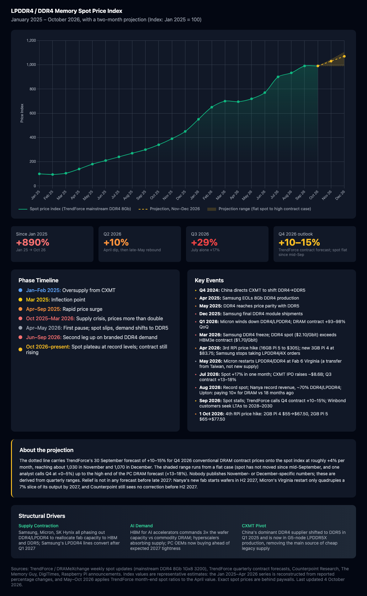

# LPDDR4 / DDR4 Memory Spot Price Index

An interactive chart tracking the rise in LPDDR4 and DDR4 memory prices from January 2025 through October 2026, with a dotted two-month projection for November and December 2026.

## The Story

Memory prices are up roughly **+890%** since January 2025, driven by three things at once:

- **AI demand** — HBM for AI accelerators now commands 3× the wafer capacity vs commodity DRAM, and PC OEMs are buying ahead of expected 2027 tightness
- **Supply contraction** — Samsung, Micron, and SK Hynix are phasing out DDR4/LPDDR4 to focus on HBM and DDR5; Samsung stopped accepting LPDDR4/4X orders in April 2026
- **CXMT pivot** — China's dominant DDR4 supplier shifted to DDR5 production in Q1 2025 and is now on its G5 node making LPDDR5X

The impact is visible in products like the Raspberry Pi 5, which has now seen four price rises in a year. The 16GB model went from $120 to $205 in February 2026 and to $305 in April. Raspberry Pi introduced a 3GB Pi 4 at $83.75 in April because two 1.5GB LPDDR4 chips were cheaper to source than one 4GB part, and on 1 October 2026 it raised the 2GB Pi 4 and Pi 5, which it had held at $55 and $65, to $67.50 and $77.50. Eben Upton told CNBC in August that the company is paying ten times more for DRAM than eighteen months earlier.

After a pause in April and May 2026, spot prices climbed again from June through September — July alone was +17% — before stalling at record levels in mid-September. TrendForce's 30 September outlook still calls for Q4 2026 contract prices to rise another 10–15%, and nobody forecasts relief before late 2027: Nanya's new fab starts wafers in H2 2027, Micron's Virginia DDR4/LPDDR4 restart is a transfer from Taiwan rather than net new capacity, and Counterpoint sees no correction before the second half of 2027.

## Key Dates

| Date | Event |
|------|-------|
| Q4 2024 | China directs CXMT to shift DDR4→DDR5 |
| Mar 2025 | Inflection point — prices begin rising |
| Apr 2025 | Samsung EOLs 8Gb DDR4 production |
| May 2025 | DDR4 reaches price parity with DDR5 |
| Dec 2025 | Samsung final DDR4 module shipments |
| Q1 2026 | Micron winds down DDR4/LPDDR4; DRAM contract +93–98% QoQ |
| Mar 2026 | Samsung DDR4 freeze; DDR4 spot overtakes HBM3e contract per Gbit |
| Apr 2026 | 3rd RPi price hike (16GB Pi 5 to $305); new 3GB Pi 4 at $83.75; Samsung stops taking LPDDR4 orders |
| May 2026 | Micron restarts LPDDR4/DDR4 at Fab 6, Virginia |
| Jul 2026 | Spot +17% in a month; CXMT IPO; Q3 contract +13–18% |
| Aug 2026 | Record spot; Nanya record revenue; Upton: DRAM cost 10× in 18 months |
| Sep 2026 | Spot plateaus; TrendForce calls Q4 contract +10–15% |
| 1 Oct 2026 | 4th RPi price hike: 2GB Pi 4 $67.50, 2GB Pi 5 $77.50 |

## The projection

The dotted line spreads TrendForce's +10–15% Q4 contract forecast evenly across the quarter, about +4% per month, from the last spot reading. The shaded band runs from a flat case (spot has not moved since mid-September) to the upper end of the PC DRAM forecast. No source publishes month-specific numbers for November or December; the band is there to make that uncertainty visible rather than to hide it.

## View the Chart

**Option 1:** [View live version](https://nthanksforallthefish.github.io/Raspberry-Pi-Prices/)

**Option 2:** Download `index.html` and open it in any browser

## Data Sources

- [TrendForce](https://www.trendforce.com/price/dram/dram_spot) — weekly DRAM spot updates (mainstream DDR4 8Gb 1Gx8 3200) and quarterly contract forecasts
- [Counterpoint Research](https://counterpointresearch.com/) — Memory market analysis
- [The Memory Guy](https://thememoryguy.com/) — DDR4/DDR5 price trend analysis
- [DigiTimes](https://www.digitimes.com/) — Nanya, Winbond and CXMT supply news
- [Raspberry Pi Announcements](https://www.raspberrypi.com/news/) — Product pricing updates

**Note:** Index values are representative estimates. The January 2025 to April 2026 series is reconstructed from reported percentage changes; May to October 2026 applies TrendForce month-end spot ratios to the April value. Exact spot prices are behind industry paywalls. Last updated 4 October 2026.

## Tech Stack

- Plain HTML/CSS/JavaScript (no build tools required)
- [Chart.js](https://www.chartjs.org/) for visualization

## License

MIT — use freely, attribution appreciated.
